# Modul „Einsätze & Stundennachweise“ (Arbeitnehmerüberlassung)

Erweiterung von incub:workflow für die FESS recruitment GmbH & Co. KG: Rohtext der Dispo → strukturierter Einsatz → Konkretisierung (§ 1 Abs. 1 Satz 6 AÜG) → personalisierte Mitarbeiter-Links mit digitaler Unterschrift → Stundennachweis-PDF → Auswertung, Lohnvorbereitung, Excel- und zvoove-Export.

Bestehende Funktionen (Belege, Auslagen, Beiblatt-PDFs, Abgleich, DATEV) sind unverändert. Das Modul nutzt dieselbe Auth (`/login`, Session-Cookie), denselben Mandanten-Schlüssel und dieselbe Ablage-Idee (Dateien als Bytes in Postgres).

## 1. Ablauf

```mermaid
flowchart LR
  A[Rohtext WhatsApp/Mail] -->|POST /api/assignments/parse| B[Claude Structured Output<br/>Fallback: Heuristik]
  B --> C[Namens-Matching<br/>exakt → normalisiert → Trigram]
  C --> D[Konfliktprüfung<br/>Ruhezeit 11 h · 10 h/24 h · Doppelbuchung<br/>gegen ALLE Einsätze]
  D --> E[Vorschau, editierbar<br/>/einsaetze/neu]
  E -->|speichern| F[(assignments, shifts,<br/>shift_assignments + Tokens)]
  F --> G[Konkretisierung PDF<br/>Kategorie konkretisierung]
  F --> H[Jobs: Link-Versand 24 h vorher,<br/>Erinnerung nach Schichtende]
  H --> I[/e/token: Zeiten, Pause,<br/>PKW, Spesen, Unterweisung, Signatur/]
  H --> J[/e/crew/token: alle Personen<br/>+ Kunde auf einem Gerät/]
  I --> K[(time_entries v1, gesperrt<br/>Signatur-PNG im Blob-Speicher)]
  J --> K
  K -->|alle unterschrieben| L[Stundennachweis PDF<br/>Kategorie stundennachweis]
  K --> M[Freigabe: erfasst → geprüft → freigegeben]
  M --> N[/auswertung: Summen aus SQL/]
  N --> O[Excel 4 Blätter]
  N --> P[zvoove-CSV<br/>Mapping + Validierung]
```

Zeitziele (Abnahme): Rohtext → PDF unter zwei Minuten (Parser ca. 5–15 s, Rest ist Prüfen/Klicken); Mitarbeiter-Erfassung inkl. Unterschrift unter 60 s (vorbelegte Zeiten, drei Pflichtaktionen: Haken, Unterschrift, Absenden).

## 2. Wo was liegt

| Bereich | Pfad |
|---|---|
| Datenmodell | `prisma/schema.prisma` (Abschnitt „Modul Einsätze & Stundennachweise“), Migration `prisma/migrations/20260918003757_einsatz_modul/` (+ `down.sql`) |
| Seed | `prisma/seed-einsatz.ts` (2 Kunden, 10 Mitarbeiter, Standard-Lohnarten, Beispieleinsatz `2026-0918-01`) |
| Kernlogik | `src/lib/einsatz/` – `tz.ts` (Europe/Berlin), `hours.ts`, `holidays.ts`, `bundesland.ts`, `wage.ts` (Regelwerk), `parser.ts` (Claude + Heuristik), `matching.ts`, `conflicts.ts`, `numbering.ts`, `blob.ts`, `documents.ts`, `rate-limit.ts`, `access.ts`, `safety.ts`, `mail.ts`, `analytics.ts` |
| Services | `src/lib/einsatz/service/` – `assignments.ts`, `time-entries.ts`, `pdf.ts`, `links.ts`, `public-view.ts` |
| Jobs | `src/lib/einsatz/jobs/` (`queue.ts`, `handlers.ts`, `worker.ts`), Start in `src/instrumentation.ts`, Cron-Route `POST /api/jobs/run` |
| PDFs | `src/lib/einsatz/pdf/` (`layout.tsx`, `konkretisierung.tsx`, `stundennachweis.tsx` inkl. Anlage Sicherheitsunterweisung) |
| Exporte | `src/lib/export/stunden-excel.ts`, `src/lib/export/zvoove.ts`, `config/zvoove-mapping.json`, `scripts/zvoove-detect.ts` |
| API | `src/app/api/assignments/parse`, `src/app/api/e/[token]`, `src/app/api/e/[token]/pdf`, `src/app/api/e/crew/[token]`, `src/app/api/documents/[id]`, `src/app/api/blobs/[id]`, `src/app/api/jobs/run` |
| Mitarbeiter-Link | `src/app/e/` (Layout, `[token]`, `crew/[token]`, Signatur-Canvas, Offline-Puffer `offline.ts`), Service Worker `public/sw-einsatz.js` |
| Dispo | `src/app/(app)/einsaetze/` (Liste, `neu`, `[id]`, `freigabe`, `kunden`, `personal`, `lohnarten`), `src/app/(app)/auswertung/`, `src/app/(app)/dokumente/` |
| Tests | `tests/unit/*` (vitest), `tests/integration/parser.test.ts` (gemockter Claude-Aufruf), `tests/e2e/einsatz.spec.ts` (Playwright) |

## 3. Datenmodell

Alle Tabellen tragen `organizationId` (das „entity_id“-Prinzip des Projekts), `id` (cuid wie im Rest des Projekts), `createdAt`, `updatedAt` und – wo fachlich sinnvoll – `createdById`.

| Tabelle | Inhalt |
|---|---|
| `customers` | Entleiher: Name, Adresse, USt-ID, Ansprechpartner (+E-Mail/Telefon), Standard-Einsatzort, Bundesland (Feiertage), AÜ-Vertrag, aktiv |
| `employees` | Vorname, Nachname, zvoove-Personalnummer (unique je Mandant), E-Mail, Mobil, Geburtsdatum, Status, `lohnartDefaults` (z. B. Zulagen), zvoove-ID. Trigram-Index auf dem Namen |
| `assignments` | Einsatz: Kunde, Projekt, Artist, Einsatzort, Bundesland, Datum von/bis, `einsatznummer` (JJJJ-MMTT-lfd), Einsatzbereich, AÜ-Vertrag, Status `ENTWURF → KONKRETISIERT → LAUFEND → ABGESCHLOSSEN → ABGERECHNET`, Notizen, Rohtext, geparstes JSON, Crew-Token |
| `assignment_number_counters` | Zähler je Mandant und Tag für die Einsatznummer |
| `shifts` | Schicht: Bezeichnung, Tätigkeit, Datum, Plan-Beginn/-Ende (UTC), Treffpunkt, Sollzahl, optionale Garantiestunden |
| `shift_assignments` | Person je Schicht mit Rolle (Mitarbeiter/Ansprechpartner/Spare), Planzeiten, `token` (UUID, unique), Ablauf (30 Tage nach Schichtende), `tokenUsedAt` (Einmalnutzung), Status, Versand-/Erinnerungszeitpunkt |
| `time_entries` | Ist-Zeiten, Pause, `stundenGesamt`, Tätigkeit, Notiz, PKW/Art, Spesen/Betrag, Unterschrift-Referenz, Zeitpunkt, Unterweisung bestätigt + Version, IP, User-Agent, Gerät, Quelle, Review-Status, Prüfer/Freigeber. **Versionierung:** `version`, `aktuell`, `korrigiertVonId`, `korrekturGrund` – signierte Einträge werden nie geändert; eine Korrektur legt eine neue Version an |
| `trips` | Fahrten je Zeiteintrag (von, nach, km, Reihenfolge) |
| `assignment_confirmations` | Kundenunterschrift je Einsatz (Name, Referenz, Zeitpunkt, IP) |
| `documents` + `documents_link` | Dokumentenspeicher (Kategorie `konkretisierung`, `stundennachweis`, `export`; Bytes, SHA-256, Meta) und Verknüpfung mit Einsatz, Mitarbeiter, Kunde, Datum |
| `blobs` | Unterschriften als PNG (DB-Adapter); in `time_entries` steht nur die Referenz-URL |
| `wage_rules` | Lohnartenregeln: Name, Typ, `bedingung` (JSON), Lohnart, Faktor, aktiv, Reihenfolge |
| `manual_deductions` | Manuelle Abzüge (Person, Datum, Lohnart, Stunden/Betrag, Grund) |
| `month_locks` | Gesperrte Monate |
| `jobs` | Postgres-Job-Queue (Typ, Payload, `runAt`, Status, Versuche, Fehler, Dedupe-Schlüssel) |

Audit: alle Änderungen laufen über den bestehenden Logger (`audit_log`) mit `alt`/`neu` im `data`-Feld – Signaturen, Korrekturen, Freigaben, Dokumentablage (mit SHA-256), Regeländerungen, Monatssperren.

Rollback der Migration: `psql "$DATABASE_URL" -f prisma/migrations/20260918003757_einsatz_modul/down.sql` und den Eintrag aus `_prisma_migrations` löschen (siehe Kopf der Datei).

## 4. Parser

- Route `POST /api/assignments/parse` (nur Dispo-Rollen). Modell `claude-sonnet-4-6` (per `ANTHROPIC_PARSER_MODEL` änderbar), striktes JSON über Structured Output (`messages.parse` + `zodOutputFormat`), kein Markdown.
- Ohne `ANTHROPIC_API_KEY` oder bei API-Fehler greift der deterministische Heuristik-Parser (`parseHeuristic`), der das Dispo-Format `Bezeichnung | 08:00 Uhr | 2x Hands` + Namensliste liest. Der Beispiel-Rohtext aus der Aufgabenstellung ist als Test hinterlegt (`tests/unit/parser.test.ts`) und wird auch im UI per „Beispiel einfügen“ angeboten.
- Analyse nach beiden Wegen: Dubletten je Schicht, Personen ohne Nachnamen/Spitznamen, Abweichung von der Sollzahl, fehlende Start-/Endzeit (Endzeit wird mit 8 h vorgeschlagen und im UI orange markiert).
- Namens-Matching: exakt → normalisiert (ohne Diakritika, Reihenfolge egal) → Fuzzy per `pg_trgm` (`similarity ≥ 0,35`, JS-Bigram-Fallback ohne Extension). Nur exakt/normalisiert gilt als sicher; Fuzzy-Treffer erscheinen als „Vorschläge (bitte bestätigen)“ und werden nie automatisch übernommen. Neue Personen können direkt aus der Vorschau angelegt werden.
- Arbeitszeitkonflikte laufen serverseitig gegen alle Einsätze des Mandanten (±3 Tage): < 11 h Ruhezeit, > 10 h in 24 h, Überschneidung. Speichern ist nur mit bewusstem Haken „Konflikte geprüft“ möglich.

## 5. PDFs

`@react-pdf/renderer` (bereits im Projekt, reines JS, kein Chromium – läuft auf Railway ohne Zusatzpakete; Puppeteer hätte ein ~300 MB Image und Sandbox-Sonderfälle bedeutet).

- `Konkretisierung_<Projekt>_<Datum>.pdf`: fess.jobs-Wortmarke (Orange `#E3682E`), Titel, Metablock, Tabelle (Nr., Name, Schicht, Beginn, Ende, Tätigkeit, Funktion), Schlusstext mit § 1 Abs. 1 Satz 6 AÜG, Unterschriftszeilen. Wird beim Speichern aus der Vorschau automatisch erzeugt (abwählbar) und setzt den Status auf „konkretisiert“.
- `Stundennachweis_<Projekt>_<Datum>.pdf` (Querformat): Tabelle mit Ist-Zeiten, Pause, Gesamt, Tätigkeit, PKW, Spesen, Notiz, Unterschrift als Bild + Zeitstempel; Block Fahrten; Kundenbestätigung (Name + Unterschrift oder Leerzeile); Bestätigungstext; Seite 2 Anlage „Sicherheitsunterweisung und PSA“ zweispaltig mit Version/Stand im Fuß.
- Beide landen unveränderlich im Dokumentenspeicher mit SHA-256 im Audit-Log; jede Neuerzeugung ist ein neues Dokument (die Historie bleibt).

## 6. Mitarbeiter-Link

- `/e/[token]`: mobil zuerst, hell, Akzent `#E3682E`, große Touchflächen. Kopf (Einsatz, Kunde, Ort, Datum, eigene Schicht), Zeiten vorbelegt, Pause, Tätigkeit, PKW (privat/Firma, beliebig viele Fahrten), Spesen (+ optionaler Betrag), Notiz, aufklappbare Unterweisung mit Pflicht-Haken, Signatur-Canvas, Absenden.
- Danach gesperrt (Leseansicht + PDF-Download über `/api/e/[token]/pdf`). Änderungen nur durch die Dispo mit Begründung als neue Version.
- Token: UUID v4 (122 Bit, unerratbar), 30 Tage ab Schichtende gültig, einmalige Nutzung für die Signatur (`tokenUsedAt`). Rate-Limit je IP (30 GET / 10 POST pro Minute) und Sperre nach 10 unbekannten Tokens in 15 Minuten. „Links erneuern“ erzeugt neue Tokens für alle, die noch nicht unterschrieben haben.
- `/e/crew/[token]`: Liste aller Personen des Einsatzes, jede unterschreibt nacheinander; am Ende unterschreibt der Kunde (Feld Name + Signatur) – das löst die Neuerzeugung des Stundennachweis-PDFs aus.
- Offline: Service Worker `sw-einsatz.js` (Scope `/e/`) hält Seite und letzte Token-Daten vor; Einreichungen landen bei fehlendem Netz in IndexedDB und werden beim nächsten `online`-Event/Öffnen nachgesendet (Background Sync, wo verfügbar). Fachliche Ablehnungen (z. B. bereits signiert) werden nicht endlos wiederholt.
- Versand: beim Klick „Links planen“ werden je Person zwei Jobs angelegt – `link.versand` (24 h vor Schichtbeginn, sofort falls näher) und `link.erinnerung` (2 h nach Schichtende, nur wenn noch nicht erfasst). E-Mail über SMTP (`SMTP_URL`, `MAIL_FROM`), sonst nur der fertige WhatsApp-Text zum Kopieren in der Detailansicht.

## 7. Lohnvorbereitung

Regelwerk in `wage_rules`, alle Werte in der Oberfläche (`/einsaetze/lohnarten`) pflegbar. Vorbelegung (Seed):

| Regel | Typ | Lohnart | Bedingung |
|---|---|---|---|
| Normalstunden | NORMAL | 100 | – |
| Garantiestunden | GARANTIE | 100 | `{"stunden": 4}` (je Schicht überschreibbar; zwei Schichten am Tag = zwei Garantien) |
| Nachtzuschlag | NACHT | 166 | `{"fenster":[{"von":"23:00","bis":"06:00"}]}`, anteilig nach Minuten, Pause anteilig |
| Sonntag | SONNTAG | 146 | `{"nichtWennFeiertag": true}` (Feiertag hat Vorrang) |
| Feiertag | FEIERTAG | 156 | Kalender je Bundesland (Einsatz → Kunde → aus Einsatzort abgeleitet → BW) |
| Fahrt Privat-PKW | FAHRT_PRIVAT | 700 | `{"satzProKm": 0.30}` (steuerfrei) |
| Fahrt Firmenfahrzeug | FAHRT_FIRMA | 701 | `{"satzProKm": 0}` (versteuert) |
| Zulage Stapler / Rigger | ZULAGE | 210 / 211 | `{"taetigkeiten": [...], "proStunde": …}` – trifft über Tätigkeit oder Mitarbeiter-Zulagen |
| Spesen | SPESEN | 800 | `{"pauschale": 14}` |
| Abzug | ABZUG | 900 | manuell (`/einsaetze/lohnarten`) |

Freigabe-Workflow (`/einsaetze/freigabe`): erfasst → geprüft → freigegeben, Bulk-Aktionen, Warnhinweise (ohne Unterschrift, Plan/Ist > 30 min, Version). Nur freigegebene Zeiten gehen in die Exporte. Gesperrte Monate (`month_locks`) verhindern Erfassung, Korrektur und Status-Änderung.

## 8. Exporte

- Excel (`exceljs`): Blatt „Zeiteinträge“ (Rohform), „Je Person“, „Je Kunde“, „Lohnarten“ (je Person und Monat, inkl. Abzüge). Spaltenbreiten, Zahlenformate, Filterzeile, SUBTOTAL-Summenzeile.
- zvoove-CSV: `config/zvoove-mapping.json` steuert Trennzeichen, Zeichensatz (`windows-1252` Standard, eigener Encoder ohne Zusatzabhängigkeit), Datumsformat, Dezimaltrennzeichen, Kopfzeile, Spaltenreihenfolge, Pflichtfelder, Betragszeilen. Liegt `docs/zvoove-sample.csv` vor, werden Format und Spalten daraus abgeleitet und in die JSON zurückgeschrieben (automatisch beim nächsten Export oder manuell per `npm run zvoove:detect`). Validierung vor dem Download: fehlende Personalnummer, Stunden = 0, unbekannte Lohnart, Datum außerhalb, fehlender Kunde/Tätigkeit → Fehlerliste; Export erst nach Behebung oder wahlweise ohne die fehlerhaften Zeilen.
- Beide Exporte sind je Kunde, je Person und je Monat möglich (Filter im Export-Panel) und werden als Kategorie `export` im Dokumentenspeicher archiviert.

## 9. Konfiguration

| Variable | Bedeutung |
|---|---|
| `ANTHROPIC_API_KEY` | Claude-Parser (ohne Key: Heuristik) |
| `ANTHROPIC_PARSER_MODEL` | Standard `claude-sonnet-4-6` |
| `APP_BASE_URL` | Öffentliche URL für die Links (z. B. `https://…up.railway.app`) – ohne sie sind Links relativ |
| `SMTP_URL`, `MAIL_FROM` | E-Mail-Versand der Links (optional) |
| `JOBS_SECRET` | Bearer-Token für externe Cron-Aufrufe von `POST /api/jobs/run` |
| `JOBS_WORKER` | `off` deaktiviert den In-Prozess-Worker; `JOBS_INTERVAL_MS` Intervall (Standard 60 s) |
| `S3_BUCKET`, `S3_ENDPOINT`, `S3_REGION`, `S3_ACCESS_KEY_ID`, `S3_SECRET_ACCESS_KEY`, `S3_PATH_STYLE` | Optionaler S3-Adapter für Unterschriften (Standard: DB) |

Railway: Migration läuft wie bisher beim Start (`docker-entrypoint.sh`), der Seed ergänzt Kunden/Mitarbeiter/Lohnarten idempotent. `config/` und `docs/` werden ins Runtime-Image kopiert.

## 10. Tests

- `npm test` – vitest: Stunden (Mitternacht, DST, Nachtfenster, Sonntag), Lohnarten (alle Regeltypen, Feiertag je Bundesland, Garantie), Feiertage/Bundesland, Heuristik-Parser (Beispiel-Rohtext), Konflikte, zvoove-Mapping/Validierung/Encoding; Integration: Parser mit gemocktem `@anthropic-ai/sdk`.
- `npm run build && npm run test:e2e` – Playwright gegen den Standalone-Build: Rohtext → speichern → Konkretisierung-PDF → Mitarbeiter-Link (mobil) → Unterschrift → Sperre → Crew-Link (zweite Person + Kunde) → Jobs → Stundennachweis unter `stundennachweis` → Freigabe → Auswertung (Summen) → Excel- und zvoove-Export inkl. Validierung. Benötigt `DATABASE_URL` mit Seed.

## 11. Getroffene Annahmen

1. **Prisma statt roher SQL-Migrationen**, `organizationId` statt `entity_id`, cuid-IDs statt UUID – so wie der Rest des Projekts. Die Tabellennamen entsprechen der Vorgabe.
2. **Keine BullMQ/Redis-Infrastruktur** im Repo → Postgres-Job-Queue mit derselben Semantik (verzögert, Retry mit Backoff, Dedupe, `SKIP LOCKED`). Worker läuft im Next-Server (Instrumentation); zusätzlich Cron-Route.
3. **Dokumentenspeicher**: Es gab nur `receipt_files` (belegbezogen). Deshalb neue generische Tabelle `documents` + `documents_link` mit denselben Prinzipien (Bytes in DB, unveränderlich).
4. **Signaturen** liegen als PNG im Blob-Speicher (Tabelle `blobs`, in `time_entries` nur die Referenz). Ein S3-kompatibler Adapter (SigV4) ist enthalten, aber ohne echten Bucket ungetestet.
5. `stunden_gesamt` wird zentral im Service berechnet (kein DB-generiertes Feld, da Prisma generierte Spalten nicht abbildet).
6. Rollen: Admin und Mitglied = Dispo; Buchhaltung = lesend + Freigabe + Lohnarten + Exporte; Einreicher-Kiosk hat keinen Zugriff.
7. Pausen werden bei Nacht-/Sonntags-/Feiertagsminuten anteilig (Netto/Brutto) abgezogen.
8. Sonntag und Feiertag am selben Tag: nur Feiertag (konfigurierbar).
9. Feiertagskalender: bundesweite + landesspezifische Feiertage; regionale Ausnahmen (Fronleichnam in Teilen von SN/TH, Mariä Himmelfahrt nur in Teilen Bayerns, Augsburger Friedensfest) fehlen bewusst. Fallback-Bundesland BW.
10. Einsatznummer: Tag des ersten Schichtbeginns, laufende Nummer zweistellig je Mandant und Tag.
11. Token-Gültigkeit 30 Tage ab Schichtende (nicht ab Erzeugung), damit späte Erfassungen möglich bleiben.
12. Crew-Link gilt für den ganzen Einsatz (alle Schichten), nicht nur eine Schicht.
13. Standard-Schichtlänge 8 h, wenn der Rohtext keine Endzeit nennt (im UI markiert).
14. Ohne `SMTP_URL` werden keine Mails versendet; der WhatsApp-Text ist immer verfügbar.
15. Excel/zvoove enthalten nur **freigegebene** Zeiteinträge; manuelle Abzüge nur ohne Kunden-/Einsatzfilter.

## 12. Offene Punkte (Entscheidung nötig)

1. **zvoove-Spaltenlayout**: Bitte eine echte Datei aus der Stundenschnellerfassung unter `docs/zvoove-sample.csv` ablegen (oder die JSON manuell anpassen). Aktuell ist ein plausibles Standardlayout hinterlegt; unbekannte Spaltenköpfe würden als „leer“ übernommen.
2. **Lohnarten-Nummern und Sätze** (100/166/146/156, 0,30 €/km, Zulagen, Spesenpauschale) sind Vorbelegungen – bitte in `/einsaetze/lohnarten` prüfen.
3. **Nachtzuschlag-Fenster** 23–6 Uhr und die Garantie von 4 h je Schicht sind Annahmen (tarifliche Vorgaben, z. B. iGZ/BAP, könnten abweichen).
4. **AÜ-Vertragsreferenz** je Kunde und Verleiher-Anschrift auf den PDFs: derzeit nur Firmenname; Adresse/Registerdaten der FESS recruitment GmbH & Co. KG nachtragen (`src/lib/einsatz/safety.ts`, `VERLEIHER`).
5. **Sicherheitsunterweisung**: Inhalt ist ein fachlich plausibler Entwurf (Version 1.0, Stand 2026-09-01) – bitte durch die Fachkraft für Arbeitssicherheit freigeben; danach Version hochsetzen.
6. **Objektspeicher**: DB-Ablage reicht für den Start; bei vielen Unterschriften/PDFs S3-Variablen setzen (Adapter vorhanden) und ggf. den Adapter gegen den echten Bucket testen.
7. **BullMQ**: Falls Redis später bereitsteht, kann `lib/einsatz/jobs/queue.ts` durch einen BullMQ-Adapter ersetzt werden (Schnittstelle `enqueueJob`/`registerJobHandler`/`runDueJobs`).
8. **Mehrere Railway-Instanzen**: Das In-Memory-Rate-Limit und der Worker gehen von einer Instanz aus; bei Skalierung Rate-Limit in Postgres/Redis verlagern und `JOBS_WORKER=off` + externer Cron.
9. **Datenschutz**: IP, User-Agent und Gerät werden je Signatur gespeichert (Nachweiszweck). Aufbewahrungsfristen und Löschkonzept sind noch festzulegen.
10. **Mitarbeiter-Stammdaten**: Personalnummern für alle Aktiven pflegen (Export-Validierung), E-Mail/Mobil für den Versand.
11. **Ansprechpartner-Rolle**: Rechte des Ansprechpartners vor Ort (Crew-Link) sind aktuell identisch mit dem Einsatz-Token; eine PIN-Absicherung ist möglich, aber nicht umgesetzt.
