# Modul „Einsätze & Stundennachweise“ (Arbeitnehmerüberlassung)

Erweiterung von incub:workflow für die FESS recruitment GmbH & Co. KG: Rohtext oder Screenshot der Dispo → strukturierter Einsatz → Konkretisierung (§ 1 Abs. 1 Satz 6 AÜG) → **ein Gruppenlink für alle** mit digitaler Unterschrift → Stundennachweis-PDF → Auswertung, Lohnvorbereitung, Excel- und zvoove-Export.

Bestehende Funktionen (Belege, Auslagen, Beiblatt-PDFs, Abgleich, DATEV) sind unverändert. Das Modul nutzt dieselbe Auth (`/login`, Session-Cookie), denselben Mandanten-Schlüssel und dieselbe Ablage-Idee (Dateien als Bytes in Postgres).

## 1. Ablauf

```mermaid
flowchart LR
  A[Rohtext WhatsApp/Mail<br/>und/oder Screenshot, PDF, Tabelle] -->|POST /api/assignments/parse| B[Claude Structured Output<br/>Fallback: Heuristik]
  B --> C[Namens-Matching<br/>exakt → normalisiert → Trigram]
  C --> D[Konfliktprüfung<br/>Ruhezeit 11 h · 10 h/24 h · Doppelbuchung<br/>gegen ALLE Einsätze]
  D --> E[Vorschau, editierbar<br/>/einsaetze/neu]
  E -->|speichern| F[(assignments, shifts,<br/>shift_assignments + Tokens)]
  F --> G[Konkretisierung PDF<br/>Kategorie konkretisierung]
  F --> H[Gruppenlink + WhatsApp-Nachricht<br/>Jobs: Einzelversand 24 h vorher,<br/>Erinnerung nach Schichtende]
  H --> J[/e/crew/token: ein Link für alle<br/>Namen korrigieren, Person ergänzen,<br/>jede unterschreibt, dann der Kunde/]
  H --> I[/e/token: Einzellink, Zeiten, Pause,<br/>PKW, Spesen, Unterweisung, Signatur/]
  I --> K[(time_entries v1, gesperrt<br/>Signatur-PNG im Blob-Speicher)]
  J --> K
  K -->|alle unterschrieben + Kunde| L[Stundennachweis PDF<br/>Kategorie stundennachweis<br/>je Einsatz genau eines]
  L --> Q[/Crew sieht das PDF im Link:<br/>ansehen, teilen, herunterladen/]
  K --> M[Freigabe: erfasst → geprüft → freigegeben]
  M --> N[/auswertung: Summen aus SQL/]
  N --> O[Excel 4 Blätter]
  N --> P[zvoove-CSV<br/>Mapping + Validierung]
```

Zeitziele (Abnahme): Rohtext → PDF unter zwei Minuten (Parser ca. 5–15 s, Rest ist Prüfen/Klicken); Mitarbeiter-Erfassung inkl. Unterschrift unter 60 s (vorbelegte Zeiten, drei Pflichtaktionen: Haken, Unterschrift, Absenden).

## 2. Wo was liegt

| Bereich | Pfad |
|---|---|
| Datenmodell | `prisma/schema.prisma` (Abschnitt „Modul Einsätze & Stundennachweise“), Migrationen `prisma/migrations/20260918003757_einsatz_modul/`, `20260918091612_disponent_rolle/`, `20260922090000_schicht_zeitvorgabe/` (jeweils mit `down.sql`) |
| Seed | `prisma/seed-einsatz.ts` (2 Kunden, 10 Mitarbeiter, Standard-Lohnarten, Beispieleinsatz `2026-0918-01`) |
| Kernlogik | `src/lib/einsatz/` – `tz.ts` (Europe/Berlin), `hours.ts`, `holidays.ts`, `bundesland.ts`, `wage.ts` (Regelwerk), `parser.ts` (Claude + Heuristik), `anhaenge.ts` (Screenshot/PDF/Tabelle), `matching.ts`, `conflicts.ts`, `numbering.ts`, `blob.ts`, `documents.ts`, `rate-limit.ts`, `access.ts`, `roles.ts`, `base-url.ts`, `safety.ts`, `mail.ts`, `analytics.ts` |
| Stammdaten-Import | `src/lib/einsatz/import/` – `parse-table.ts` (CSV/XLSX, Spaltenerkennung), `stammdaten.ts` (Vorschau + Import für Mitarbeiter und Kunden) |
| Services | `src/lib/einsatz/service/` – `assignments.ts`, `time-entries.ts`, `pdf.ts`, `links.ts`, `besetzung.ts` (Namen lesen, Besetzung und Kopfdaten ändern), `crew-roster.ts` (dieselbe Logik über den Gruppenlink, mit engeren Grenzen), `public-view.ts` |
| Jobs | `src/lib/einsatz/jobs/` (`queue.ts`, `handlers.ts`, `worker.ts`), Start in `src/instrumentation.ts`, Cron-Route `POST /api/jobs/run` |
| PDFs | `src/lib/einsatz/pdf/` (`layout.tsx`, `konkretisierung.tsx`, `stundennachweis.tsx` inkl. Anlage Sicherheitsunterweisung) |
| Exporte | `src/lib/export/stunden-excel.ts`, `src/lib/export/zvoove.ts`, `config/zvoove-mapping.json`, `scripts/zvoove-detect.ts` |
| API | `src/app/api/assignments/parse`, `src/app/api/e/[token]`, `src/app/api/e/[token]/pdf`, `src/app/api/e/crew/[token]`, `src/app/api/e/crew/[token]/pdf`, `src/app/api/documents/[id]`, `src/app/api/blobs/[id]`, `src/app/api/jobs/run` |
| Mitarbeiter-Link | `src/app/e/` (Layout, `[token]`, `crew/[token]`, `tutorial.tsx` (Kurzanleitung), `pdf-share.tsx`, Signatur-Canvas, Offline-Puffer `offline.ts`), Service Worker `public/sw-einsatz.js` |
| Dispo | `src/app/(app)/einsaetze/` (Liste, `neu`, `[id]`, `freigabe`, `kunden`, `kunden/import`, `personal`, `personal/import`, `lohnarten`), `src/app/(app)/auswertung/`, `src/app/(app)/dokumente/` |
| Tests | `tests/unit/*` (vitest), `tests/integration/parser.test.ts` (gemockter Claude-Aufruf), `tests/e2e/*.spec.ts` (Playwright: `einsatz`, `crew`, `anhang`, `import`, `disponent`) |

## 3. Datenmodell

Alle Tabellen tragen `organizationId` (das „entity_id“-Prinzip des Projekts), `id` (cuid wie im Rest des Projekts), `createdAt`, `updatedAt` und – wo fachlich sinnvoll – `createdById`.

| Tabelle | Inhalt |
|---|---|
| `customers` | Entleiher: Name, Adresse, USt-ID, Ansprechpartner (+E-Mail/Telefon), Standard-Einsatzort, Bundesland (Feiertage), AÜ-Vertrag, aktiv |
| `employees` | Vorname, Nachname, zvoove-Personalnummer (unique je Mandant), E-Mail, Mobil, Geburtsdatum, Status, `lohnartDefaults` (z. B. Zulagen), zvoove-ID. Trigram-Index auf dem Namen |
| `assignments` | Einsatz: Kunde, Projekt, Artist, Einsatzort, Bundesland, Datum von/bis, `einsatznummer` (JJJJ-MMTT-lfd), Einsatzbereich, AÜ-Vertrag, Status `ENTWURF → KONKRETISIERT → LAUFEND → ABGESCHLOSSEN → ABGERECHNET`, Notizen, Rohtext, geparstes JSON, Crew-Token |
| `assignment_number_counters` | Zähler je Mandant und Tag für die Einsatznummer |
| `shifts` | Schicht: Bezeichnung, Tätigkeit, Datum, Plan-Beginn/-Ende (UTC), Treffpunkt, Sollzahl, optionale Garantiestunden |
| `shift_assignments` | Person je Schicht mit Rolle (Mitarbeiter/Ansprechpartner/Spare), Planzeiten, `token` (UUID, unique), Ablauf (30 Tage nach Schichtende), `tokenUsedAt` (Einmalnutzung), Status, Versand-/Erinnerungszeitpunkt |
| `time_entries` | Ist-Zeiten, Pause, `stundenGesamt`, Tätigkeit, Notiz, PKW/Art, Spesen/Betrag, Unterschrift-Referenz, Zeitpunkt, Unterweisung bestätigt + Version, IP, User-Agent, Gerät, Quelle, Review-Status, Prüfer/Freigeber. **Versionierung:** `version`, `aktuell`, `korrigiertVonId`, `korrekturGrund` – signierte Einträge werden nie geändert; eine Korrektur legt eine neue Version an |
| `trips` | Fahrten je Zeiteintrag (von, nach, km, Reihenfolge) |
| `assignment_confirmations` | Kundenunterschrift je Einsatz (Name, Referenz, Zeitpunkt, IP) |
| `documents` + `documents_link` | Dokumentenspeicher (Kategorie `konkretisierung`, `stundennachweis`, `export`; Bytes, SHA-256, Meta) und Verknüpfung mit Einsatz, Mitarbeiter, Kunde, Datum |
| `blobs` | Unterschriften als PNG (DB-Adapter); in `time_entries` steht nur die Referenz-URL |
| `wage_rules` | Lohnartenregeln: Name, Typ, `bedingung` (JSON), Lohnart, Faktor, aktiv, Reihenfolge |
| `manual_deductions` | Manuelle Abzüge (Person, Datum, Lohnart, Stunden/Betrag, Grund) |
| `month_locks` | Gesperrte Monate |
| `jobs` | Postgres-Job-Queue (Typ, Payload, `runAt`, Status, Versuche, Fehler, Dedupe-Schlüssel) |

Audit: alle Änderungen laufen über den bestehenden Logger (`audit_log`) mit `alt`/`neu` im `data`-Feld – Signaturen, Korrekturen, Freigaben, Dokumentablage (mit SHA-256), Regeländerungen, Monatssperren.

Rollback der Migration: `psql "$DATABASE_URL" -f prisma/migrations/20260918003757_einsatz_modul/down.sql` und den Eintrag aus `_prisma_migrations` löschen (siehe Kopf der Datei).

## 4. Parser

- Route `POST /api/assignments/parse` (nur Dispo-Rollen). Modell `claude-sonnet-4-6` (per `ANTHROPIC_PARSER_MODEL` änderbar), striktes JSON über Structured Output (`messages.parse` + `zodOutputFormat`), kein Markdown.
- Ohne `ANTHROPIC_API_KEY` oder bei API-Fehler greift der deterministische Heuristik-Parser (`parseHeuristic`), der das Dispo-Format `Bezeichnung | 08:00 Uhr | 2x Hands` + Namensliste liest. Der Beispiel-Rohtext aus der Aufgabenstellung ist als Test hinterlegt (`tests/unit/parser.test.ts`) und wird auch im UI per „Beispiel einfügen“ angeboten.
- Analyse nach beiden Wegen: Dubletten je Schicht, Personen ohne Nachnamen/Spitznamen, Abweichung von der Sollzahl, fehlende Start-/Endzeit (Endzeit wird mit 8 h vorgeschlagen und im UI orange markiert).
- Namens-Matching: exakt → normalisiert (ohne Diakritika, Reihenfolge egal) → Fuzzy per `pg_trgm` (`similarity ≥ 0,35`, JS-Bigram-Fallback ohne Extension). Nur exakt/normalisiert gilt als sicher; Fuzzy-Treffer erscheinen als „Vorschläge (bitte bestätigen)“ und werden nie automatisch übernommen. Neue Personen können direkt aus der Vorschau angelegt werden.
- Arbeitszeitkonflikte laufen serverseitig gegen alle Einsätze des Mandanten (±3 Tage): < 11 h Ruhezeit, > 10 h in 24 h, Überschneidung. Speichern ist nur mit bewusstem Haken „Konflikte geprüft“ möglich.

### 4a. Screenshot, Foto, PDF und Tabelle als Vorlage

Der Rohtext ist nicht mehr Pflicht. `/einsaetze/neu` nimmt zusätzlich oder stattdessen Dateien an (höchstens 5, je 5 MB); `POST /api/assignments/parse` versteht dafür `multipart/form-data` (JSON mit `rawText` bleibt gültig).

| Art | Weg |
|---|---|
| Bild (`png`, `jpg`, `gif`, `webp`) | als `image`-Block an die Claude API, **vor** dem Text |
| PDF | als `document`-Block an die Claude API |
| Text, CSV, TSV, Markdown, EML | serverseitig dekodiert und an den Rohtext gehängt (`--- dateiname ---`) |
| Excel (`xlsx`, `xlsm`) | über `parse-table.ts` in Textzeilen umgewandelt und angehängt |

Text- und Tabellendateien gehen damit gar nicht erst an die API: billiger, deterministisch und auch ohne `ANTHROPIC_API_KEY` über die Heuristik nutzbar (die Heuristik überspringt die Dateiüberschriften und Trennlinien). Bilder und PDFs kann die Heuristik nicht lesen – ohne API-Schlüssel steht das ausdrücklich in den Hinweisen, statt einen leeren Einsatz zu zeigen. Abgelehnte Dateien (zu groß, zu viele, unbekannter Typ) erscheinen mit Begründung in derselben Hinweisliste. Ein Screenshot lässt sich auch mit Strg + V direkt einfügen.

### 4b. Stammdaten importieren

`/einsaetze/personal/import` und `/einsaetze/kunden/import` (Rolle Dispo, also auch Disponent) lesen Excel- oder CSV-Listen. Die Spalten werden an den Überschriften erkannt, die Reihenfolge spielt keine Rolle; Trennzeichen (`;`, `,`, Tab, `|`) und Zeichensatz werden ermittelt.

- Schritt 1 **Vorschau**: je Zeile ein Befund – neu, wird ergänzt, unverändert, Fehler. Es wird nichts gespeichert.
- Schritt 2 **Übernehmen**: Abgleich über die Personalnummer, sonst über den exakten Namen (Kunden über den Namen). Leere Felder in der Datei überschreiben nichts, es entstehen keine Dubletten.
- Einteilige Namen werden abgelehnt: die Konkretisierung nach AÜG benennt die Person namentlich.
- Bundesländer werden ausgeschrieben und als Kürzel erkannt, Adresse aus Straße/PLZ/Ort zusammengesetzt, Datumsangaben deutsch und ISO.

### 4c. Einsatz nachträglich bearbeiten

Ein Einsatz ist bis zur Kundenbestätigung ein Entwurf. Was wann geht, entscheidet `bearbeitbarkeit()` in `service/besetzung.ts`:

| Stand | Kopfdaten | Schichtzeiten | Besetzung | Namen |
|---|---|---|---|---|
| angelegt, nichts unterschrieben | ✅ | ✅ | ✅ | ✅ |
| erste Unterschrift liegt vor | ✅ | ❌ (Zeitkorrektur je Person) | ✅ | ✅ |
| Kunde hat bestätigt | ❌ | ❌ | ❌ | ✅ |
| Zeiten freigegeben | ❌ | ❌ | ❌ | ✅ |
| abgeschlossen/abgerechnet | ❌ | ❌ | ❌ | ✅ |

**Namen bleiben immer änderbar** – Leute heiraten, und auf dem Nachweis muss der richtige Name stehen. „Name ändern“ je Person hängt die Einteilung auf einen vorhandenen Stammsatz um oder benennt einen Datensatz um, der nur für diese eine Einteilung entstanden ist. Hat die Person schon unterschrieben, sagt die Oberfläche das: der neue Name erscheint erst auf einem neu erzeugten Stundennachweis, die bisherige Fassung bleibt mit ihrer Prüfsumme im Protokoll.

Schichtzeiten ändern zieht die Planzeiten der eingeteilten Personen mit – außer bei denen, die schon unterschrieben haben – und rechnet den Einsatzzeitraum (`datumVon`/`datumBis`) aus allen Schichten neu, in Berliner Tagen.

### 4d. Namen aus der Zwischenablage

Je Schicht gibt es „+ Namen einfügen“: Liste hineinkopieren, prüfen, übernehmen. `namenAusText()` liest

- eine Person je Zeile, zusätzlich am Semikolon getrennt,
- „Nachname, Vorname“ gedreht – aber nur, wenn genau zwei Teile dastehen, der zweite ein einzelnes Wort ist und der erste als Nachname durchgeht („von der Heide, Jana“ ✅, „Max Mustermann, Erika Musterfrau“ bleibt eine Aufzählung),
- Aufzählungszeichen, Nummerierung und Rollenkürzel ((AP), (Spare), Vorarbeiter …),
- und wirft Dubletten sowie Kopf-, Datums- und Schichtzeilen eines mitkopierten Plans raus.

Danach läuft derselbe Abgleich wie beim Anlegen (exakt → normalisiert → Trigram). Die Vorschau zeigt je Zeile die Zuordnung zur Auswahl: sicherer Treffer, Vorschlag, neu anlegen oder nicht übernehmen. Wer schon auf der Schicht steht, ist vorausgewählt auf „nicht übernehmen“.

## 5. PDFs

`@react-pdf/renderer` (bereits im Projekt, reines JS, kein Chromium – läuft auf Railway ohne Zusatzpakete; Puppeteer hätte ein ~300 MB Image und Sandbox-Sonderfälle bedeutet).

- `Konkretisierung_<Projekt>_<Datum>.pdf`: fess.jobs-Wortmarke (Orange `#E3682E`), Titel, Metablock, Tabelle (Nr., Name, Schicht, Beginn, Ende, Tätigkeit, Funktion), Schlusstext mit § 1 Abs. 1 Satz 6 AÜG, Unterschriftszeilen. Wird beim Speichern aus der Vorschau automatisch erzeugt (abwählbar) und setzt den Status auf „konkretisiert“.
- `Stundennachweis_<Projekt>_<Datum>.pdf` (Querformat): Tabelle mit Ist-Zeiten, Pause, Gesamt, Tätigkeit, PKW, Spesen, Notiz, Unterschrift als Bild + Zeitstempel; Block Fahrten; Kundenbestätigung (Name + Unterschrift oder Leerzeile); Bestätigungstext; Seite 2 Anlage „Sicherheitsunterweisung und PSA“ zweispaltig mit Version/Stand im Fuß.
- Beide landen unveränderlich im Dokumentenspeicher mit SHA-256 im Audit-Log. **Je Einsatz gibt es genau ein Konkretisierungs- und genau ein Stundennachweis-PDF**: eine Neuerzeugung ersetzt die vorherige Fassung, deren SHA-256 und Dateiname im Audit-Log stehen bleiben. Vorher sammelten sich bei jeder Unterschrift neue Zwischenstände an.

## 6. Mitarbeiter-Link

### 6a. Ein Link für alle (Hauptweg)

`/e/crew/[token]` gilt für den ganzen Einsatz. Die Dispo kopiert in der Detailansicht eine **fertige WhatsApp-Nachricht** (Kunde, Projekt, Datum, alle Schichten mit Zeiten und Treffpunkt, genau ein Link) und schickt sie in die Gruppe; „In WhatsApp öffnen“ ruft `wa.me` mit vorbereitetem Text auf. Jede Person öffnet den Link auf dem eigenen Handy, tippt den eigenen Namen an und unterschreibt – oder alle nacheinander auf einem Crew-Gerät. Am Ende unterschreibt der Kunde (Name + Signatur); das löst die Erzeugung des Stundennachweis-PDFs aus.

Die Einzellinks je Person bleiben erhalten (automatischer Versand, Nachzügler), stehen in der Detailansicht aber ausgeklappt unter dem Gruppenlink.

### 6b. Kurzanleitung beim Öffnen

Die meisten bekommen den Link in der WhatsApp-Gruppe und haben die Oberfläche noch nie gesehen. Beim ersten Öffnen liegt deshalb eine Kurzanleitung davor (`src/app/e/tutorial.tsx`, eingehängt im Layout):

1. Eigenen Namen antippen (nur im Gruppenlink – im Einzellink entfällt der Schritt)
2. Zeiten prüfen – Beginn, Ende, Pause sind vorbelegt
3. Fahrtkosten – nur wenn selbst gefahren: Fahrzeugart, Start, Ziel, Kilometer
4. Spesen – nur wenn vorher mit der Dispo besprochen
5. Unterweisung bestätigen und unterschreiben – danach gesperrt

Darüber steht hervorgehoben der Hinweis, die **Sicherheitsunterweisung vor Arbeitsbeginn** zu lesen und nicht erst beim Unterschreiben.

Gemerkt wird das im `localStorage` des Browsers (`fess.einsatz.tutorial.v1`, versioniert: ändert sich der Text, erscheint die Anleitung einmal wieder). Schlägt der Zugriff fehl – privater Modus, blockierte Speicherung –, erscheint sie eben erneut; die Seite funktioniert in beiden Fällen. Über das **?** oben rechts lässt sie sich jederzeit noch einmal aufrufen, Escape und ein Klick daneben schließen sie.

### 6c. Die Crew korrigiert sich selbst

Der Parser verliest sich bei Namen, und manchmal kommt jemand kurzfristig dazu. Beides lässt sich im Gruppenlink ohne Login richtigstellen:

- **„Name falsch?“** je Person: richtige Schreibweise eintragen. Gibt es im Stamm schon jemanden mit dem Namen, wird die Einteilung dorthin umgehängt; ist der bisherige Datensatz nur für diesen Einsatz entstanden (keine Personalnummer, keine Kontaktdaten, keine zweite Einteilung), wird er umbenannt – so entstehen keine Karteileichen.
- **„+ Person ergänzen“** je Schicht: Vor- und Nachname eintragen, die Person kann sofort unterschreiben. Vorhandene Personen werden erkannt statt doppelt angelegt; eine stornierte Einteilung wird reaktiviert.

Grenzen: Eine Person, die bereits unterschrieben hat, wird nicht mehr umbenannt (der Name steht auf dem Beleg). Nach der Kundenbestätigung sind beide Aktionen gesperrt – ab da korrigiert nur noch die Dispo. Jede Änderung steht mit altem und neuem Namen, IP und Quelle `crew-link` im Audit-Log.

### 6d. Zeiten für alle übernehmen

Bei einem Einsatz arbeiten fast alle dieselbe Schicht. Hat die erste Person ihre Ist-Zeiten eingetragen und unterschrieben, steht auf der Schicht ein Knopf: **„Zeiten von X für alle N Übrigen übernehmen“**. Danach sind Beginn, Ende und Pause bei allen noch offenen Erfassungen vorausgefüllt – im Gruppenlink und im Einzellink – mit einem Hinweis, von wem sie stammen und dass sich abweichen lässt.

**Unterschreiben muss weiterhin jede Person selbst.** Die Vorgabe füllt nur das Formular vor; eine Zeit ohne eigene Unterschrift wäre als Nachweis wertlos. Wer anders gearbeitet hat, ändert die Felder und unterschreibt seine eigenen Zeiten.

Gespeichert wird die Vorgabe auf der Schicht (`vorgabeStart`, `vorgabeEnde`, `vorgabePause`, `vorgabeVon`, `vorgabeAm`, Migration `20260922090000_schicht_zeitvorgabe`) – also pro Schicht, nicht pro Einsatz: „Load-Out 21:30“ bekommt nicht die Zeiten von „Aufbau 07:00“. Die Dispo sieht die Vorgabe in der Schichtzeile und kann sie zurücknehmen; danach starten neue Erfassungen wieder mit den Planzeiten. Wer sie gesetzt hat, mit welchen Zeiten und für wie viele Offene, steht im Audit-Log.

### 6e. Der fertige Beleg

Sobald der Kunde bestätigt hat, zeigt der Link den unterschriebenen Stundennachweis: **Ansehen**, **Teilen** (Web Share API mit der PDF-Datei, sonst mit dem Link) und **Herunterladen** über `GET /api/e/crew/[token]/pdf` bzw. `GET /api/e/[token]/pdf`. Das PDF entsteht in einem Hintergrund-Job – solange es fehlt, steht dort „wird gerade erstellt“ und die Seite fragt alle drei Sekunden nach (zehnmal), statt einen Fehler zu zeigen.

### 6f. Einzellink und Technik

- `/e/[token]`: mobil zuerst, hell, Akzent `#E3682E`, große Touchflächen. Kopf (Einsatz, Kunde, Ort, Datum, eigene Schicht), Zeiten vorbelegt, Pause, Tätigkeit, PKW (privat/Firma, beliebig viele Fahrten), Spesen (+ optionaler Betrag), Notiz, aufklappbare Unterweisung mit Pflicht-Haken, Signatur-Canvas, Absenden.
- Danach gesperrt (Leseansicht + PDF). Änderungen nur durch die Dispo mit Begründung als neue Version.
- Token: UUID v4 (122 Bit, unerratbar), 30 Tage ab Schichtende gültig, einmalige Nutzung für die Signatur (`tokenUsedAt`). Rate-Limit je IP (30 GET / 10 POST pro Minute, 20 PDF-Abrufe) und Sperre nach 10 unbekannten Tokens in 15 Minuten. „Links erneuern“ erzeugt neue Tokens für alle, die noch nicht unterschrieben haben.
- Die Links sind immer vollständige, öffentlich erreichbare Adressen. `base-url.ts` nimmt `APP_BASE_URL`, sonst `NEXT_PUBLIC_APP_URL`, sonst `RAILWAY_PUBLIC_DOMAIN`, sonst den Host des laufenden Aufrufs – und verwirft dabei interne Adressen (`*.railway.internal`, `localhost`, private IP-Bereiche), die sich auf dem Handy nicht öffnen lassen. Steht `APP_BASE_URL` auf so einer Adresse, sagt die Detailansicht das im Klartext.
- Offline: Service Worker `sw-einsatz.js` (Scope `/e/`) hält Seite und letzte Token-Daten vor; Einreichungen landen bei fehlendem Netz in IndexedDB und werden beim nächsten `online`-Event/Öffnen nachgesendet (Background Sync, wo verfügbar). Fachliche Ablehnungen (z. B. bereits signiert) werden nicht endlos wiederholt.
- Versand: beim Klick „Links planen“ werden je Person zwei Jobs angelegt – `link.versand` (24 h vor Schichtbeginn, sofort falls näher) und `link.erinnerung` (2 h nach Schichtende, nur wenn noch nicht erfasst). E-Mail über SMTP (`SMTP_URL`, `MAIL_FROM`), sonst nur der fertige Text zum Kopieren.

## 7. Lohnvorbereitung

Regelwerk in `wage_rules`, alle Werte in der Oberfläche (`/einsaetze/lohnarten`) pflegbar. Vorbelegung (Seed):

| Regel | Typ | Lohnart | Bedingung |
|---|---|---|---|
| Normalstunden | NORMAL | 100 | – |
| Garantiestunden | GARANTIE | 100 | `{"stunden": 4}` (je Schicht überschreibbar; zwei Schichten am Tag = zwei Garantien) |
| Nachtzuschlag | NACHT | 166 | `{"fenster":[{"von":"23:00","bis":"06:00"}]}`, anteilig nach Minuten, Pause anteilig |
| Sonntag | SONNTAG | 146 | `{"nichtWennFeiertag": true}` (Feiertag hat Vorrang) |
| Feiertag | FEIERTAG | 156 | Kalender je Bundesland (Einsatz → Kunde → aus Einsatzort abgeleitet → BW) |
| Fahrt Privat-PKW | FAHRT_PRIVAT | 700 | `{"satzProKm": 0.30}` (steuerfrei) |
| Fahrt Firmenfahrzeug | FAHRT_FIRMA | 701 | `{"satzProKm": 0}` (versteuert) |
| Zulage Stapler / Rigger | ZULAGE | 210 / 211 | `{"taetigkeiten": [...], "proStunde": …}` – trifft über Tätigkeit oder Mitarbeiter-Zulagen |
| Spesen | SPESEN | 800 | `{"pauschale": 14}` |
| Abzug | ABZUG | 900 | manuell (`/einsaetze/lohnarten`) |

Freigabe-Workflow (`/einsaetze/freigabe`): erfasst → geprüft → freigegeben, Bulk-Aktionen, Warnhinweise (ohne Unterschrift, Plan/Ist > 30 min, Version). Nur freigegebene Zeiten gehen in die Exporte. Gesperrte Monate (`month_locks`) verhindern Erfassung, Korrektur und Status-Änderung.

## 8. Exporte

- Excel (`exceljs`): Blatt „Zeiteinträge“ (Rohform), „Je Person“, „Je Kunde“, „Lohnarten“ (je Person und Monat, inkl. Abzüge). Spaltenbreiten, Zahlenformate, Filterzeile, SUBTOTAL-Summenzeile.
- zvoove-CSV: `config/zvoove-mapping.json` steuert Trennzeichen, Zeichensatz (`windows-1252` Standard, eigener Encoder ohne Zusatzabhängigkeit), Datumsformat, Dezimaltrennzeichen, Kopfzeile, Spaltenreihenfolge, Pflichtfelder, Betragszeilen. Liegt `docs/zvoove-sample.csv` vor, werden Format und Spalten daraus abgeleitet und in die JSON zurückgeschrieben (automatisch beim nächsten Export oder manuell per `npm run zvoove:detect`). Validierung vor dem Download: fehlende Personalnummer, Stunden = 0, unbekannte Lohnart, Datum außerhalb, fehlender Kunde/Tätigkeit → Fehlerliste; Export erst nach Behebung oder wahlweise ohne die fehlerhaften Zeilen.
- Beide Exporte sind je Kunde, je Person und je Monat möglich (Filter im Export-Panel) und werden als Kategorie `export` im Dokumentenspeicher archiviert.

## 9. Konfiguration

| Variable | Bedeutung |
|---|---|
| `ANTHROPIC_API_KEY` | Claude-Parser (ohne Key: Heuristik) |
| `ANTHROPIC_PARSER_MODEL` | Standard `claude-sonnet-4-6` |
| `APP_BASE_URL` | Öffentliche URL für die Links (z. B. `https://…up.railway.app`). Nicht gesetzt: `NEXT_PUBLIC_APP_URL`, dann `RAILWAY_PUBLIC_DOMAIN`, dann der Host des Aufrufs. Interne Adressen (`*.railway.internal`, `localhost`, private IPs) werden verworfen |
| `SMTP_URL`, `MAIL_FROM` | E-Mail-Versand der Links (optional) |
| `JOBS_SECRET` | Bearer-Token für externe Cron-Aufrufe von `POST /api/jobs/run` |
| `JOBS_WORKER` | `off` deaktiviert den In-Prozess-Worker; `JOBS_INTERVAL_MS` Intervall (Standard 60 s) |
| `S3_BUCKET`, `S3_ENDPOINT`, `S3_REGION`, `S3_ACCESS_KEY_ID`, `S3_SECRET_ACCESS_KEY`, `S3_PATH_STYLE` | Optionaler S3-Adapter für Unterschriften (Standard: DB) |

Railway: Migration läuft wie bisher beim Start (`docker-entrypoint.sh`), der Seed ergänzt Kunden/Mitarbeiter/Lohnarten idempotent. `config/` und `docs/` werden ins Runtime-Image kopiert.

## 10. Tests

- `npm test` – vitest: Stunden (Mitternacht, DST, Nachtfenster, Sonntag), Lohnarten (alle Regeltypen, Feiertag je Bundesland, Garantie), Feiertage/Bundesland, Heuristik-Parser (Beispiel-Rohtext, Trennlinien), Konflikte, zvoove-Mapping/Validierung/Encoding, Link-Adressen und Gruppennachricht, `base-url` (interne Adressen), Tabellen-Import und Zeilenprüfung, Anhänge (Bild/PDF/Text/Excel, Ablehnungen), Namen aus eingefügtem Text und die Bearbeitbarkeits-Regeln; Integration: Parser mit gemocktem `@anthropic-ai/sdk` inkl. Inhaltsblöcken für Bild und PDF.
- `npm run build && npm run test:e2e` – Playwright gegen den Standalone-Build:
  - `einsatz.spec.ts`: Rohtext → speichern → Konkretisierung-PDF → Mitarbeiter-Link (mobil) → Unterschrift → Sperre → zweite Person + Kunde → Jobs → Stundennachweis unter `stundennachweis` → Freigabe → Auswertung (Summen) → Excel- und zvoove-Export inkl. Validierung.
  - `crew.spec.ts`: Gruppenlink und WhatsApp-Nachricht → Name korrigieren → Person ergänzen (inkl. Dublettenschutz) → alle unterschreiben → Kunde bestätigt → PDF abrufbar und teilbar → Korrekturen danach gesperrt.
  - `tutorial.spec.ts`: Kurzanleitung erscheint von selbst, nennt alle Schritte und den Unterweisungs-Hinweis, bleibt nach dem Wegklicken weg, ist über das ? wieder aufrufbar; Einzellink ohne den Namenslisten-Schritt.
  - `zeiten-uebernehmen.spec.ts`: erste Person erfasst abweichende Zeiten → für alle übernehmen → Gruppen- und Einzellink sind vorausgefüllt, Abweichen bleibt möglich → Dispo nimmt die Vorgabe zurück, danach wieder Planzeiten.
  - `anhang.spec.ts`: Einsatz allein aus einer angehängten Datei, Begründung für nicht lesbare Anhänge.
  - `import.spec.ts`: Mitarbeiter- und Kundenimport mit Vorschau, Übernahme und Dublettenschutz beim zweiten Lauf.
  - `bearbeiten.spec.ts`: Namen per Copy-Paste ergänzen (gedrehte Namen, Rollenkürzel, Dubletten), Kopfdaten und Schichtzeiten ändern, Namen richtigstellen vor und nach der Kundenbestätigung, Sperren danach.
  - `disponent.spec.ts`: Disponenten-Konto anlegen, gesperrte Bereiche und APIs, erlaubte Arbeit.

  Benötigt `DATABASE_URL` mit Seed. Der Testserver kopiert `.next/static` und `public` in den Standalone-Build – genau wie das Dockerfile; ohne diesen Schritt läuft die Oberfläche ohne Client-JavaScript und die Tests prüfen nur noch Progressive Enhancement.

## 11. Getroffene Annahmen

1. **Prisma statt roher SQL-Migrationen**, `organizationId` statt `entity_id`, cuid-IDs statt UUID – so wie der Rest des Projekts. Die Tabellennamen entsprechen der Vorgabe.
2. **Keine BullMQ/Redis-Infrastruktur** im Repo → Postgres-Job-Queue mit derselben Semantik (verzögert, Retry mit Backoff, Dedupe, `SKIP LOCKED`). Worker läuft im Next-Server (Instrumentation); zusätzlich Cron-Route.
3. **Dokumentenspeicher**: Es gab nur `receipt_files` (belegbezogen). Deshalb neue generische Tabelle `documents` + `documents_link` mit denselben Prinzipien (Bytes in DB, unveränderlich).
4. **Signaturen** liegen als PNG im Blob-Speicher (Tabelle `blobs`, in `time_entries` nur die Referenz). Ein S3-kompatibler Adapter (SigV4) ist enthalten, aber ohne echten Bucket ungetestet.
5. `stunden_gesamt` wird zentral im Service berechnet (kein DB-generiertes Feld, da Prisma generierte Spalten nicht abbildet).
6. Rollen: Admin und Mitglied = Dispo; Buchhaltung = lesend + Freigabe + Lohnarten + Exporte; Einreicher-Kiosk hat keinen Zugriff.
7. Pausen werden bei Nacht-/Sonntags-/Feiertagsminuten anteilig (Netto/Brutto) abgezogen.
8. Sonntag und Feiertag am selben Tag: nur Feiertag (konfigurierbar).
9. Feiertagskalender: bundesweite + landesspezifische Feiertage; regionale Ausnahmen (Fronleichnam in Teilen von SN/TH, Mariä Himmelfahrt nur in Teilen Bayerns, Augsburger Friedensfest) fehlen bewusst. Fallback-Bundesland BW.
10. Einsatznummer: Tag des ersten Schichtbeginns, laufende Nummer zweistellig je Mandant und Tag.
11. Token-Gültigkeit 30 Tage ab Schichtende (nicht ab Erzeugung), damit späte Erfassungen möglich bleiben.
12. Crew-Link gilt für den ganzen Einsatz (alle Schichten), nicht nur eine Schicht.
13. Standard-Schichtlänge 8 h, wenn der Rohtext keine Endzeit nennt (im UI markiert).
14. Ohne `SMTP_URL` werden keine Mails versendet; der WhatsApp-Text ist immer verfügbar.
15. Excel/zvoove enthalten nur **freigegebene** Zeiteinträge; manuelle Abzüge nur ohne Kunden-/Einsatzfilter.
16. **Rolle Disponent**: eigener Zugang nur fürs Einsatzmodul (`/einsaetze`, `/auswertung`, `/dokumente` und die zugehörigen APIs). Alles aus der Belegwelt ist gesperrt – Seiten leiten um, APIs antworten mit 403. Die Pfadlogik liegt in `roles.ts` ohne Abhängigkeiten, damit die Edge-Middleware kein Prisma lädt.
17. **Gruppenlink als Hauptweg**: ein Link je Einsatz statt je Person. Der Token ist der Ausweis – wer den Link hat, sieht die Namen und Planzeiten des Einsatzes und kann unterschreiben. Das entspricht dem bisherigen Crew-Link; eine zusätzliche PIN ist möglich, aber nicht umgesetzt (offener Punkt 11).
18. **Selbstkorrektur der Crew** ist bewusst eng begrenzt: nur bis zur ersten Unterschrift der jeweiligen Person und bis zur Kundenbestätigung, immer mit Audit-Eintrag. Löschen oder Stornieren von Personen bleibt bei der Dispo.
19. **Anhänge**: höchstens 5 Dateien à 5 MB. Bilder und PDFs gehen an die Claude API, Text- und Tabellendateien werden lokal gelesen. Word-Dateien werden nicht unterstützt (kein Parser im Repo, und ein Screenshot davon tut es auch).
20. **Import**: Abgleich über Personalnummer, sonst exakter Name (keine Fuzzy-Suche) – ein falscher Treffer wäre hier teurer als ein Duplikat, das die Dispo sieht.
21. **Je ein PDF pro Art und Einsatz**: die ersetzte Fassung wird gelöscht, ihr SHA-256 bleibt im Audit-Log. Wer jede Zwischenfassung aufbewahren muss, setzt `replaceForAssignmentId` in `documents.ts` außer Kraft.
22. **Die Kundenbestätigung ist die Grenze** für Kopfdaten, Schichtzeiten und Besetzung – nicht die Konkretisierung. Das PDF lässt sich jederzeit neu erzeugen, die Unterschrift des Kunden nicht.
23. **Namen sind immer änderbar**, auch nach der Bestätigung und auch nach der Unterschrift der Person. Die Alternative – Namen einfrieren – wäre in der Praxis falsch (Heirat, Schreibfehler, Namenszusätze). Die Rückverfolgbarkeit hängt am Audit-Log und an der Prüfsumme der ersetzten PDF-Fassung, nicht an der Unveränderlichkeit des Stammsatzes.
24. **Umbenennen hängt um statt zu duplizieren**: Gibt es den neuen Namen schon im Stamm, wird die Einteilung dorthin verschoben. Nur ein Datensatz ohne Personalnummer, Kontaktdaten und zweite Einteilung wird umbenannt – sonst würde ein Tippfehler bei einer Person deren gesamte Historie umbenennen.
25. **Die Zeitvorgabe füllt nur vor, sie erfasst nicht**: „Zeiten für alle übernehmen“ legt keine Einträge für andere an. Jede Person prüft und unterschreibt selbst – ein Stundennachweis mit fremdbestimmten Zeiten ohne eigene Unterschrift wäre als Nachweis wertlos. Sie gilt je Schicht, nicht je Einsatz, und erst ab der ersten unterschriebenen Erfassung.
26. **Die Kurzanleitung wird pro Browser gemerkt, nicht pro Person**: Wer den Link regelmäßig bekommt, sieht sie einmal. Auf einem geteilten Crew-Gerät bekommt sie damit nur die erste Person zu sehen – dafür ist sie über das ? erreichbar, und die Schritte stehen ohnehin im Formular.
27. **Eingefügte Namen werden nicht automatisch übernommen**: Die Vorschau verlangt je Zeile eine Entscheidung (Treffer, Vorschlag, neu anlegen, überspringen). Ein falsch zugeordneter Name landet sonst in der Konkretisierung und im Lohnexport.

## 12. Offene Punkte (Entscheidung nötig)

1. **zvoove-Spaltenlayout**: Bitte eine echte Datei aus der Stundenschnellerfassung unter `docs/zvoove-sample.csv` ablegen (oder die JSON manuell anpassen). Aktuell ist ein plausibles Standardlayout hinterlegt; unbekannte Spaltenköpfe würden als „leer“ übernommen.
2. **Lohnarten-Nummern und Sätze** (100/166/146/156, 0,30 €/km, Zulagen, Spesenpauschale) sind Vorbelegungen – bitte in `/einsaetze/lohnarten` prüfen.
3. **Nachtzuschlag-Fenster** 23–6 Uhr und die Garantie von 4 h je Schicht sind Annahmen (tarifliche Vorgaben, z. B. iGZ/BAP, könnten abweichen).
4. **AÜ-Vertragsreferenz** je Kunde und Verleiher-Anschrift auf den PDFs: derzeit nur Firmenname; Adresse/Registerdaten der FESS recruitment GmbH & Co. KG nachtragen (`src/lib/einsatz/safety.ts`, `VERLEIHER`).
5. **Sicherheitsunterweisung**: Inhalt ist ein fachlich plausibler Entwurf (Version 1.0, Stand 2026-09-01) – bitte durch die Fachkraft für Arbeitssicherheit freigeben; danach Version hochsetzen.
6. **Objektspeicher**: DB-Ablage reicht für den Start; bei vielen Unterschriften/PDFs S3-Variablen setzen (Adapter vorhanden) und ggf. den Adapter gegen den echten Bucket testen.
7. **BullMQ**: Falls Redis später bereitsteht, kann `lib/einsatz/jobs/queue.ts` durch einen BullMQ-Adapter ersetzt werden (Schnittstelle `enqueueJob`/`registerJobHandler`/`runDueJobs`).
8. **Mehrere Railway-Instanzen**: Das In-Memory-Rate-Limit und der Worker gehen von einer Instanz aus; bei Skalierung Rate-Limit in Postgres/Redis verlagern und `JOBS_WORKER=off` + externer Cron.
9. **Datenschutz**: IP, User-Agent und Gerät werden je Signatur gespeichert (Nachweiszweck). Aufbewahrungsfristen und Löschkonzept sind noch festzulegen.
10. **Mitarbeiter-Stammdaten**: Personalnummern für alle Aktiven pflegen (Export-Validierung), E-Mail/Mobil für den Versand.
11. **Absicherung des Gruppenlinks**: Wer den Link hat, sieht die Besetzung und kann unterschreiben, Namen korrigieren und Personen ergänzen. In einer WhatsApp-Gruppe ist das gewollt; wird der Link weitergeleitet, ist er trotzdem gültig. Eine PIN oder eine Bindung an die Handynummer ist möglich, aber nicht umgesetzt – bitte entscheiden, ob das nötig ist.
12. **Von der Crew ergänzte Personen** haben keine Personalnummer und fallen deshalb in der Export-Validierung auf. Gewollt (die Dispo soll das sehen) – falls nicht, müsste der Import/zvoove-Abgleich automatisch nachziehen.
13. **Teilen des PDFs**: Die Web Share API mit Dateien funktioniert auf iOS/Android in Safari und Chrome; ältere Desktop-Browser bekommen den Link bzw. den Hinweis, herunterzuladen. Ein Versand per Mail aus dem Link heraus ist nicht umgesetzt.
14. **Claude Vision für Screenshots** ist ohne `ANTHROPIC_API_KEY` wirkungslos. Ist der Key auf Railway nicht gesetzt, werden Bilder und PDFs abgelehnt (mit Hinweis) – bitte setzen, sonst ist die Funktion nur halb da.
15. **Dokumente nach einer Änderung**: Kopf-, Schicht- und Namensänderungen erzeugen die PDFs **nicht** automatisch neu – die Oberfläche weist darauf hin, den Knopf drückt die Dispo. Soll das automatisch laufen (jede Änderung stößt die Neuerzeugung an), bitte sagen; es wäre ein Job wie der Abschluss-Check.
16. **Personen entfernen** geht über „Stornieren“ (bleibt sichtbar und im Protokoll), nicht über Löschen. Wer eine versehentlich eingefügte Person wirklich aus der Liste haben will, braucht eine echte Löschfunktion – bewusst nicht gebaut.
